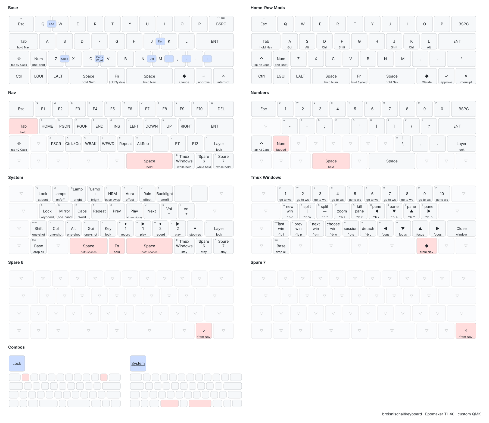

# Epomaker TH40 - custom QMK firmware

A 40% keyboard whose three indicator lamps show what Claude Code is doing, plus a general-purpose
status bus anything on the machine can use.

```bash
git clone https://github.com/broisnischal/keyboard.git && cd keyboard
./setup.sh          # clones QMK, links the keymap, builds
./flash-th40.sh     # then: unplug, hold top-left key, plug back in
```

| Doc | For |
|---|---|
| [`docs.md`](docs.md) | **Using the keyboard** - every feature and how to trigger it |
| [`keyboard.md`](keyboard.md) | **Maintaining the firmware** - build, flash, recover, and every gotcha |
| [`CLAUDE.md`](CLAUDE.md) | **Continuing the work** - orientation for a coding agent or future you |

## The keymap at a glance

All eight layers, drawn from the real `keymap.c` by
[keymap-drawer](https://github.com/caksoylar/keymap-drawer). Combo chips on the base layer show
the two-key chords; pink cells mark the key you're holding to be on that layer.



Regenerate after a keymap change (config and combo positions live in [`drawings/`](drawings)):

```bash
qmk c2json --no-cpp -kb epomaker/th40 -km tapdance -o /tmp/th40.json
keymap -c drawings/config.yaml parse -q /tmp/th40.json -l Base Nav Num System Code WM Git HRM \
  | python3 drawings/postprocess.py > drawings/keymap.yaml
keymap -c drawings/config.yaml draw drawings/keymap.yaml \
  -j qmk/keyboards/epomaker/th40/keyboard.json > drawings/keymap.svg
```

---

## The QMK situation, and why it's not the normal one

### Upstream QMK does not support this board

The TH40 uses an **es32fs026** (Essemi ES32 / FS026, Cortex-M0). That port does not exist in
`qmk/qmk_firmware` and there is no PR pending for it. Cloning upstream and looking for
`keyboards/epomaker/th40` will find nothing.

The port lives in one community fork:

```
https://github.com/carlosedp/qmk_firmware
```

which carries the ES32 platform files, a proprietary wireless blob (`lib/rdmctmzt_common`), and
about a dozen other Epomaker/Akko boards. The TH40 is on its *tested* list.

Do **not** use `carlosedp/qmk_firmware_th40` - that is the older, abandoned repo, and its own README
points at the one above.

### Cloning it without pulling 4 GB

```bash
git clone --depth 1 https://github.com/carlosedp/qmk_firmware.git qmk
cd qmk
git submodule update --init --recursive --depth 1 lib/chibios lib/chibios-contrib
```

A plain `make git-submodule` initialises every submodule - pico-sdk, lvgl, lufa, vusb, googletest -
none of which an ARM ChibiOS board touches. The two above are the only ones needed, and the shallow
flags take the clone from roughly 4 GB to 1.4 GB.

`setup.sh` does exactly this for you.

### Where keymaps live, and why this repo doesn't put one there

QMK expects:

```
qmk_firmware/keyboards/<vendor>/<board>/keymaps/<yourname>/
    keymap.c        required - the layers
    config.h        optional - #defines
    rules.mk        optional - feature switches
```

and you build with `make <vendor>/<board>:<yourname>`.

That means your work normally lives *inside* a 1.4 GB clone - which you can neither commit nor
gitignore without losing one or the other. This repo keeps the keymap at [`keymap/`](keymap) and
symlinks it into the tree:

```
qmk/keyboards/epomaker/th40/keymaps/tapdance -> ../../../../../keymap
```

QMK follows the symlink and builds normally. `qmk/` stays gitignored, the keymap stays version
controlled, and the clone is disposable - delete it and `./setup.sh` rebuilds it.

### Keeping the fork up to date

```bash
git -C qmk pull --ff-only
cd qmk && make -j$(nproc) epomaker/th40:tapdance
```

Nothing in this repo modifies the fork, deliberately. `th40.c` owns QMK's `*_user` callbacks, so the
keymap overrides the `*_kb` variants and calls through to them - which means a `git pull` can never
clobber our changes and `git -C qmk status` stays clean. If you ever find yourself editing a file
inside `qmk/`, look for the `_kb` hook first.

### Contributing the board upstream

If you want to push improvements back:

| Target | Why |
|---|---|
| [`carlosedp/qmk_firmware`](https://github.com/carlosedp/qmk_firmware) | board fixes, new Epomaker boards, ES32 platform work |
| [`qmk/qmk_firmware`](https://github.com/qmk/qmk_firmware) | only once ES32 lands upstream - it hasn't |

Standard flow: fork on GitHub, `git remote add fork git@github.com:you/qmk_firmware.git`, branch,
commit, push, open the PR against `master`. QMK's own guidance is in
[docs/contributing.md](https://github.com/qmk/qmk_firmware/blob/master/docs/contributing.md); run
`qmk format-c` and `qmk lint` before opening one.

### Useful references

- [QMK docs](https://docs.qmk.fm) - [keycodes](https://docs.qmk.fm/keycodes),
  [tap-hold](https://docs.qmk.fm/tap_hold), [combos](https://docs.qmk.fm/features/combo),
  [RGB matrix](https://docs.qmk.fm/features/rgb_matrix)
- [carlosedp/qmk_firmware releases](https://github.com/carlosedp/qmk_firmware/releases/tag/0.31.2) -
  factory firmware for these boards, if you need to go back to stock
- [VIA](https://usevia.app) - remapping without reflashing, though **anything you set in VIA is
  wiped by the next flash**, so put permanent changes in `keymap/`

---

## What's in here

| Path | |
|---|---|
| `keymap/` | the firmware: layers, effects, status bus, tap dance, combos |
| `plugins/th40/` | Claude Code plugin - `th40` CLI, `/th40` command, a skill |
| `setup.sh` | recreate the build environment from a clean clone |
| `flash-th40.sh` | wait for the bootloader, write, verify |
| `th40-via-definition.json` | VIA definition, with the custom effects added to the dropdown |
| `th40-via-keymap-backup.json` | the original VIA export the layout was derived from |
| `TH40_factory_firmware.zip` | stock firmware, for rolling back |

## Feature summary

Full detail in [`docs.md`](docs.md).

**Typing** - a tmux-style leader key (`F`+`J`, lamps go cyan while armed), double-tap Shift for
Caps Lock (zero added latency), Caps Word, Repeat and Alt-Repeat, 10 combos, Shift+Backspace →
Delete, dynamic macros, key lock, one-shot modifiers, one-handed mirror mode, pattern lock, opt-in
home-row mods with Chordal Hold and Flow Tap.

**Layers** - nav/F-keys, numbers, media+system, code operators and digraphs, Hyprland window
control, git and shell macros, plus a plain-letters base. Tri layer (both spaces → system), and
layer lock on every hold layer with a one-minute safety release.

**Lamps** - a four-slot priority bus. Slot 0 tracks Claude Code; 1-3 are yours.

```bash
th40 status working
th40 bus 1 blink red --ttl 60 --priority 95    # disk full, CI failed, wifi down
th40 config                                    # persistent settings + lock state
th40 scan-rate                                 # ~5300 matrix scans/sec
```

**Custom RGB effects** - `claude_aura` (whole board mirrors the lamps, same frame),
`claude_rain` (Matrix rain seeded by what you type), `claude_blackout` (keys dark, lamps still live).

## Hardware notes

| | |
|---|---|
| USB ID | `36b0:304e` - the marker for the **QMK version** of the TH40 |
| MCU | es32fs026, Cortex-M0, 128 KB flash, 16 KB RAM |
| Bootloader | LUFA mass-storage (`03eb:2045`) - **not** DFU, `dfu-util` will never see it |
| Flashing | copy `FIRMWARE.BIN` onto the volume that appears; there is no software entry |
| Build size | ~75 KB with LTO - **images over ~83 KB of real code do not boot** (see `keyboard.md`) |

Epomaker also shipped VIA-only TH40s. If `lsusb` shows a different ID, none of this applies to your
unit.
